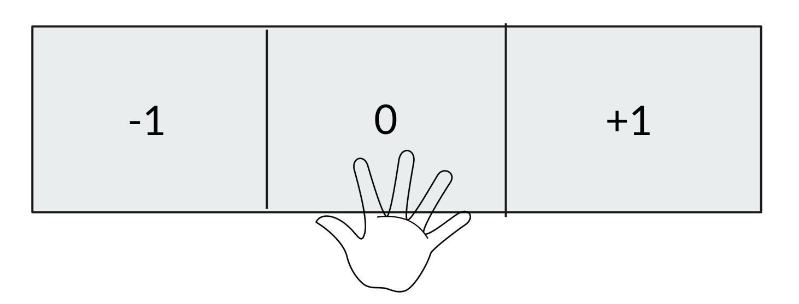

# 3D Keypoints

### Description
The user can control a DOF either by moving his/her hand (position of the wrist) on a work station.
This [3D keypoint extractor](https://github.com/ThanasisTs/openpose_utils) is being used.

#### Discrete Action

* Use `keypoint_to_discrete_action.py`

* Configuration file: `collaborative_games/src/maze_3D_game/config_keypoints.yaml`

* Listens to `<topic_to_listen_to>` topic of the transformed 3D keypoint in the config file above.
* Publishes on `<topic_to_publish_on>` topic in the config file above.

* Number of actions: 3
    * Left:-1
    * Center: 0
    * Right: +1
    